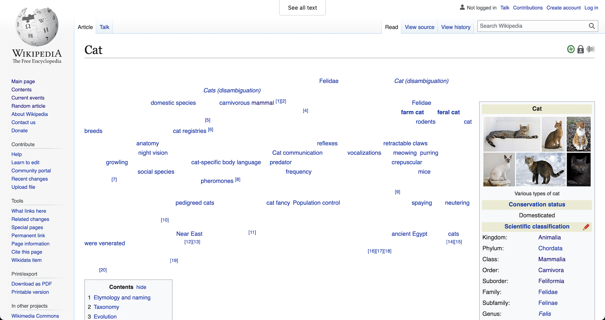

# Whittlepedia

Whittlepedia is a browser extension that filters [Wikipedia][1] pages down to
just links, allowing for rapid concept hopping.

### Effects

A new "See only links" button will be fixed at the top of each page. When
clicked, the page will fade out all text except for links, and the button will
say "See all text". Clicking again will fade text back in, and the button will
go back to saying "See only links".

### Storage

To maintain the state of the button (and whether or not to affect a page), the
extension stores an object with a single boolean flag using the
[Web Extension Storage API][2].

### Translations

The button's text is based on which language Wikipedia is being used in. The
text has been translated from English using [Google Translate][3] for the top
languages on Wikipedia's main page. I would love help making the translations
more accurate/idiomatic!

[1]: https://www.wikipedia.org
[2]: https://developer.mozilla.org/en-US/docs/Mozilla/Add-ons/WebExtensions/API/storage
[3]: https://translate.google.com/
